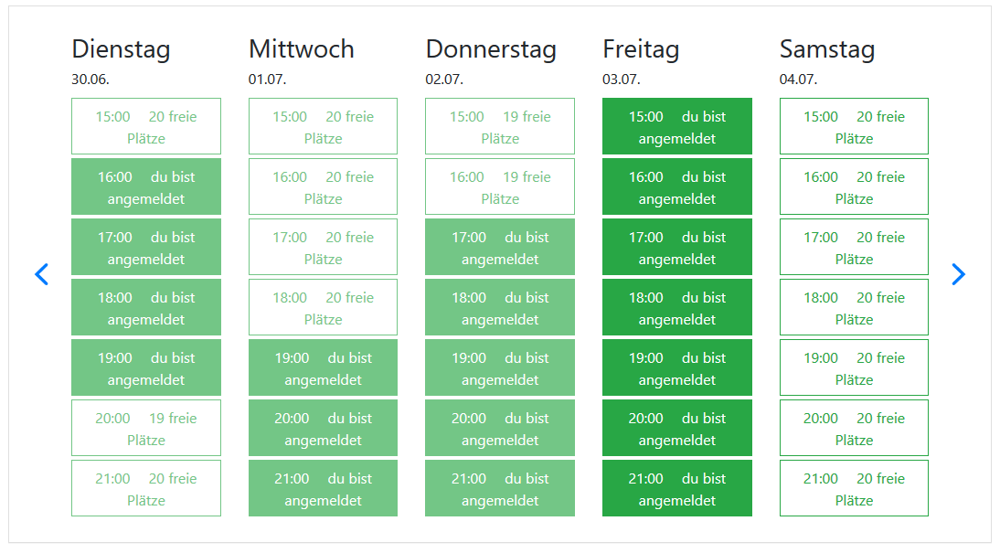
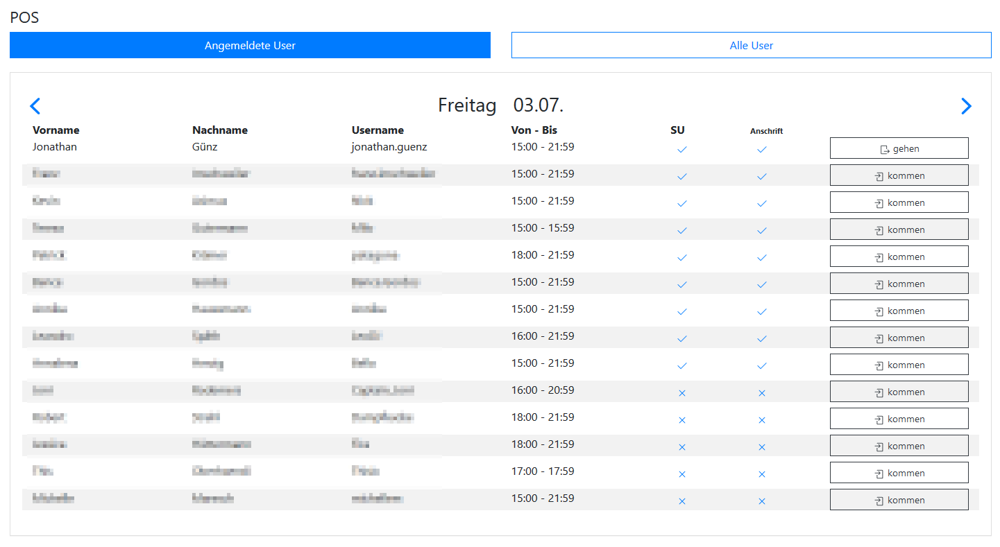
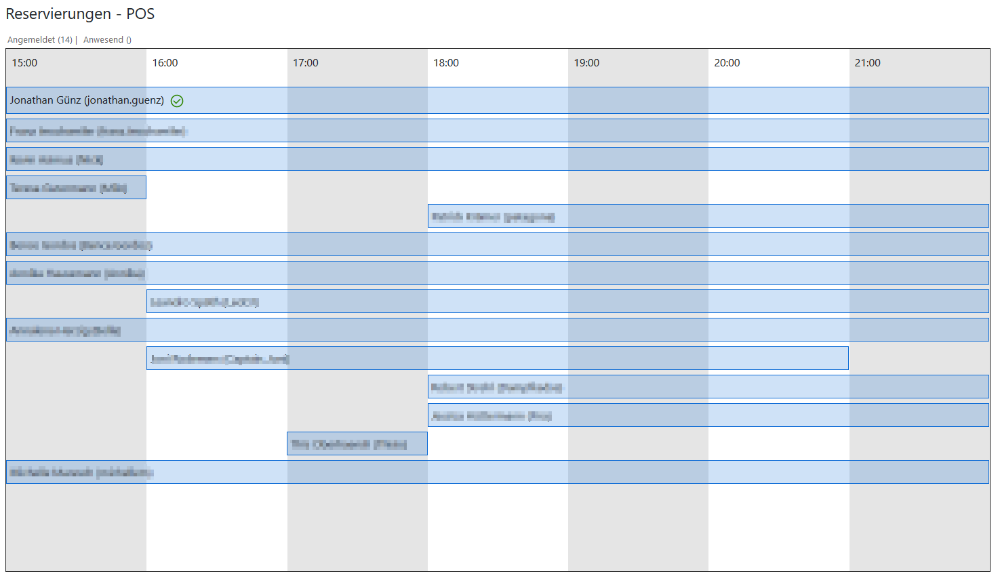

# Wordpress Plugin - Maker Space Management

This plugin is developed to manage our maker space. Its general purpose is to cover all of our needs to manage the every day live at maker space experimenta heilbronn.

## Features

### User management in LDAP

We are using LDAP for our user management. Currently we are using miniorange ldap plugin vor authentication. But registration ist done by our plugin.
Also passwort changing is implementet in this plugin.

### Managing Timeslot Reservation

Due to COVID19 we are forced to offer timeslots for our visitors, as we could only welcome a limited amount of visitors simultanious. The number of visitors can be set in the plugins settings page.

### Checkin - Deck

For logging visitors arriving/leaving the maker space. 
It is also showing, if you got the needed contact information and security/healt instructions for your visitors.

### Checkin - Timeline

Got some timelines to see the planned arrivals of your visitors.

### Shortcodes

* shortcode_visitor_count -> renders the current count of visitors marked as on location
* shortcode_table -> renders the table with the free seats per timeslot

## ToDo

* Update settings for LDAP, make it work without LDAP in Background
* Language Support
* Sorting tables in POS Page
